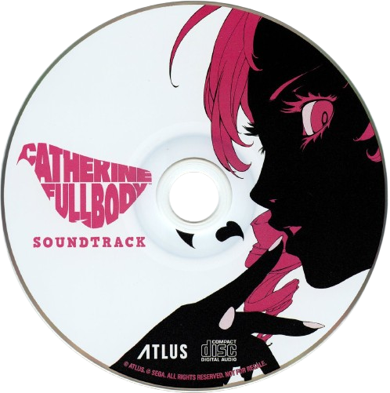

  

  
  &nbsp;&nbsp;
  
  &nbsp;&nbsp;
  

---

<h2 align="center">Know About Me</h2>

<table align="center" border="0" cellpadding="0" cellspacing="0" width="100%">
  <tr>
    <td width="30%" align="center" valign="middle">
      
    </td>
    <td width="70%" valign="top">
      <h3>Hey there! I'm Matheus dos Santos</h3>
      

        I'm a fullstack software developer who loves building applications that solve real-world problems. 
        By day, I work with Java, Spring Boot, and PostgreSQL to build robust and secure backends. By night, 
        I build highly-customizable and interactive web interfaces with React, Next.js, and TypeScript, 
        focusing on premium UX/UI and modern styling.
      

      

        Currently developing <b>Vynku</b>, a profile customization and portfolio platform for Brazilian artists, 
        and <b>InkFlow</b>, a scheduling and client management ecosystem tailored for tattoo studios.
      

    </td>
  </tr>
</table>

---

<h2 align="center">Top Projects (built to avoid manual labor)</h2>

<table align="center" border="0" cellpadding="0" cellspacing="0" width="100%">
  <tr>
    <td width="70%" valign="top">
      <ul>
        <li>
          <b>📂 Vynku</b> — A SpaceHey/MySpace-inspired portfolio and profile customization space for Brazilian artists, featuring live preview editors, dynamic themes, and a modern dashboard.
        </li>
         
        <li>
          <b>🖋️ InkFlow Frontend</b> — A beautiful, interactive frontend portfolio and scheduling system for tattoo studios and clients.
        </li>
         
        <li>
          <b>⚙️ InkFlow Backend</b> — A scalable Java & Spring Boot REST API that handles authentication, scheduling, and admin workflows for the InkFlow ecosystem.
        </li>
         
        <li>
          <b>🩹 InkFlow Care</b> — An aftercare guide and recovery tracking tool to help clients take care of their fresh tattoos.
        </li>
      </ul>
    </td>
    <td width="30%" align="center" valign="middle">
      
    </td>
  </tr>
</table>

---

<h2 align="center">Connect</h2>

  
  &nbsp;&nbsp;
  
  &nbsp;&nbsp;
  
  &nbsp;&nbsp;
  

---

  <i>"Code is never finished. It only becomes slightly less terrible over time."</i>

> Every commit I make is essentially just a small, desperate apology to my future self. Someday I will return to this codebase, look at the spaghetti I've written, and wonder who let me anywhere near a keyboard.

---

<h2 align="center">Contributions & Stats</h2>

  
    
  

