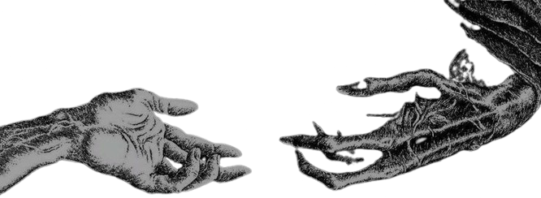
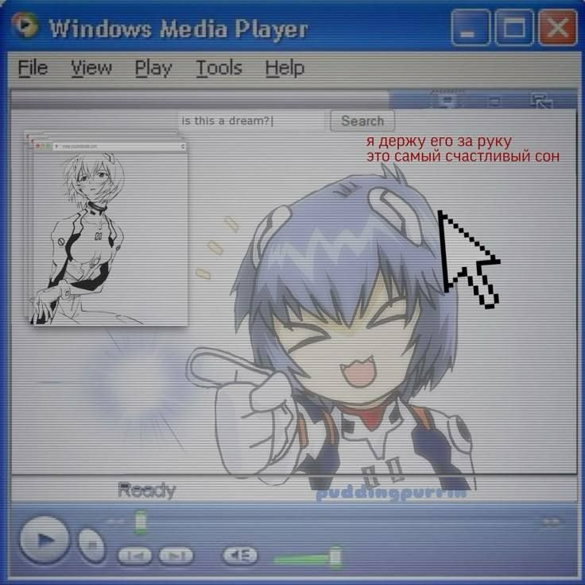

  

  
  &nbsp;&nbsp;
  

---

<h2 align="center">Sobre Mim</h2>

<table align="center" border="0" cellpadding="0" cellspacing="0" width="100%">
  <tr>
    <td width="30%" align="center" valign="middle">
      
    </td>
    <td width="70%" valign="top">
      <h3>Olá! Eu sou o Matheus :D</h3>
      

        Sou um desenvolvedor software fullstack, gosto de criar aplicações para resolver problemas do mundo real.
        No dia a dia, trabalho com Java, Spring Boot e PostgreSQL para construir backends. 
        Além disto, desenvolvo interfaces web customizáveis e interativas com React, Next.js e TypeScript,
        focando em UX/UI agradável e estilização moderna.
      

      

        Atualmente desenvolvendo o <b>Vynku</b>, uma plataforma de portfólio e customização de perfis para artistas brasileiros e amantes da estética, 
        e o <b>InkFlow</b>, um ecossistema de agendamento e gestão de clientes sob medida para estúdios e tatuadores independentes.
      

    </td>
  </tr>
</table>

---

<h2 align="center">Principais Projetos </h2>

<table align="center" border="0" cellpadding="0" cellspacing="0" width="100%">
  <tr>
    <td width="70%" valign="top">
      <ul>
        <li>
          <b> Vynku</b> — Uma plataforma de portfólio e customização de perfis inspirada no SpaceHey/MySpace para artistas brasileiros, com editores de visualização em tempo real, temas dinâmicos e um painel de controle moderno.
        </li>
         
        <li>
          <b> InkFlow Frontend</b> — Um sistema de portfólio e agendamento interativo para estúdios, tatuadores e seus clientes.
        </li>
         
        <li>
          <b> InkFlow Backend</b> — Uma API REST escalável em Java e Spring Boot que gerencia autenticação, agendamentos e fluxos administrativos para o ecossistema InkFlow.
        </li>
         
        <li>
          <b> InkFlow Care</b> — Um guia de cuidados pós-tatuagem e ferramenta de acompanhamento para ajudar os clientes a cuidarem de suas novas tatuagens.
        </li>
      </ul>
    </td>
    <td width="30%" align="center" valign="middle">
      
    </td>
  </tr>
</table>

---

<h2 align="center">Contato</h2>

  
  &nbsp;&nbsp;
  
  &nbsp;&nbsp;
  
  &nbsp;&nbsp;
  

---

  <i>"O código nunca está pronto. Ele apenas se torna um pouco menos terrível com o tempo."</i>

> Cada commit que eu faço é basicamente um pequeno e desesperado pedido de desculpas para o meu eu do futuro. Algum dia voltarei a este código, olharei para o espaguete que escrevi e me perguntarei quem deixou eu chegar perto de um teclado.

---

<h2 align="center">Contribuições & Estatísticas</h2>

  
    
  
    
  

